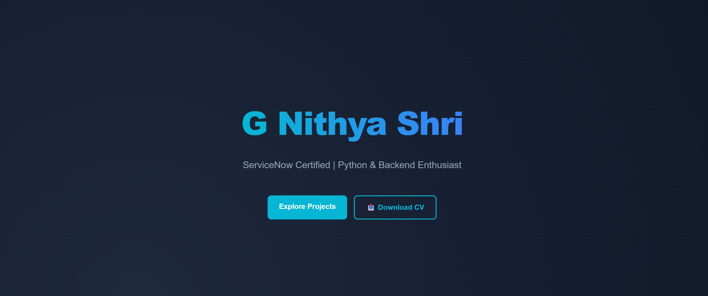

# 🌐 Personal Portfolio Website

A modern and responsive personal portfolio website built using HTML and CSS to showcase my projects, technical skills, certifications, and contact information.

**🔗 Live Website:** [gnithya-shri.github.io/Portfolio/](https://gnithya-shri.github.io/Portfolio/)

## 🚀 About the Portfolio

This portfolio highlights:
- ServiceNow projects and automation workflows
- Backend and web development projects
- Machine Learning mini-projects
- Technical skills and certifications

The website is designed with a clean UI, responsive layout, animated sections, and glassmorphism-inspired cards.

---

## 🛠 Tech Stack

- HTML5
- CSS3
- JavaScript (basic frontend interactions)
- Responsive Design
- Glassmorphism UI Design

---

## ✨ Features

- **Live Deployment:** Hosted on GitHub Pages for instant viewing.
- **Responsive Design:** Modern UI that adapts smoothly to all screen sizes.
- **Visual Appeal:** Smooth animations, hover effects, and glassmorphism-inspired cards.
- **Project Showcase:** Highlights key backend, automation, and machine learning projects.
- **Quick Access:** Direct links to a downloadable resume, GitHub, and LinkedIn.

---

## 📂 Featured Projects

### 🎟 Movie Ticket Booking System
Built using Django with concurrency handling concepts for managing simultaneous booking requests.

### 👨‍💼 ServiceNow Employee Onboarding Automation
Automated onboarding workflows using ServiceNow, improving process efficiency and reducing manual effort.

### 🏦 Loan Prediction System
Machine Learning project using Logistic Regression with data preprocessing and prediction pipeline.

---

## 📸 Portfolio Preview

